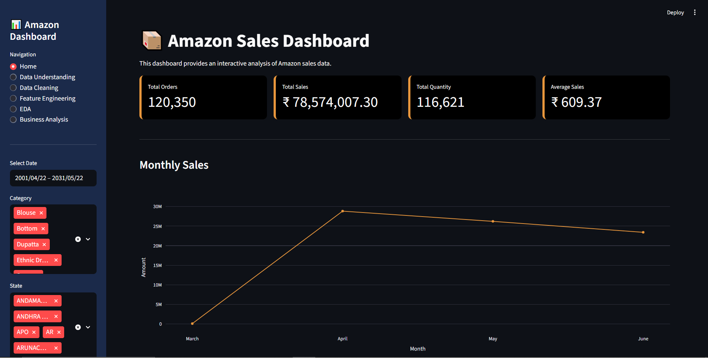
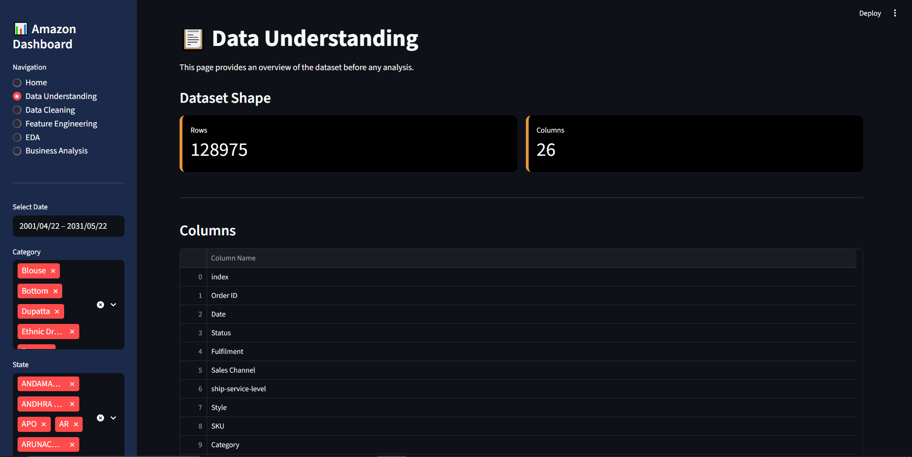
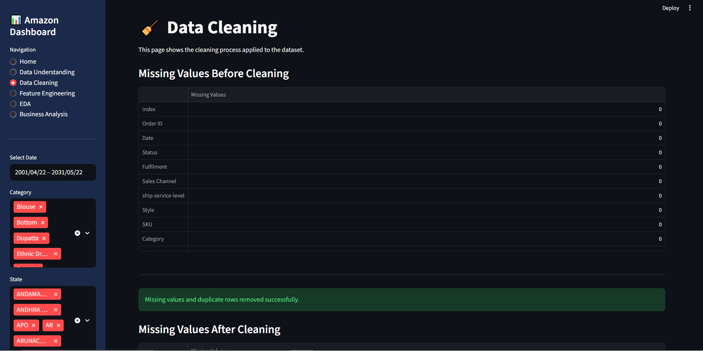
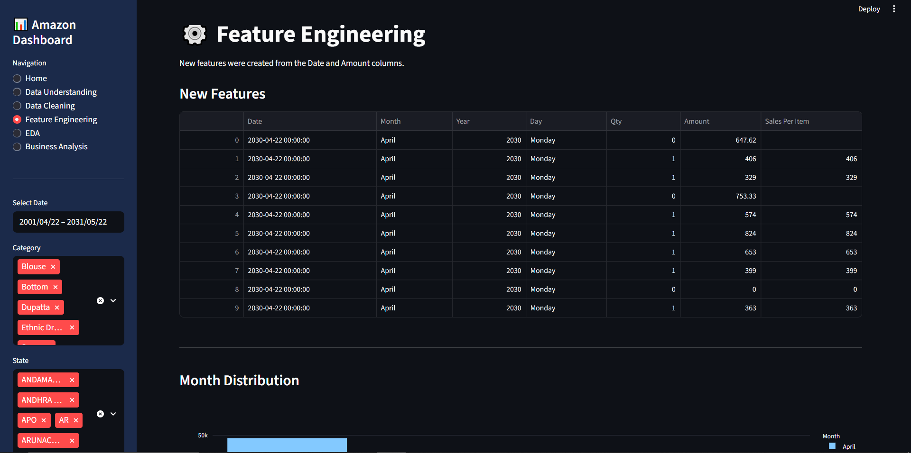
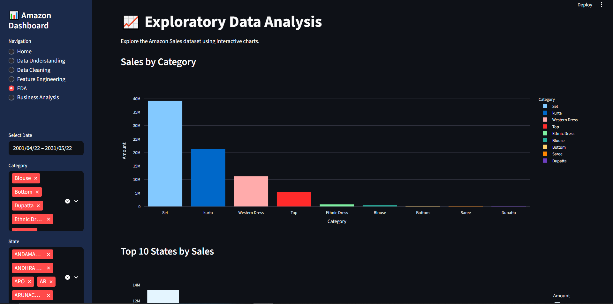
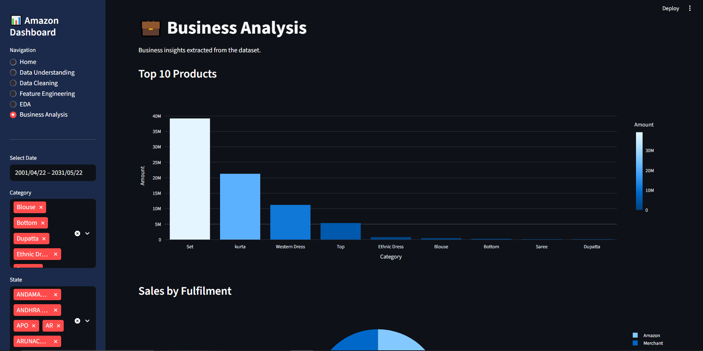

# 📊 Amazon Sales Data Analysis

<div align="center">

### Turning Amazon Sales Data into Business Insights

**Python • Pandas • Plotly • Streamlit • Jupyter Notebook**

</div>

---

## 📌 Project Overview

This project presents an end-to-end analysis of Amazon sales data, starting from **data understanding and cleaning** to **feature engineering, exploratory data analysis, business insights, and interactive dashboard development**.

The goal is to transform raw sales data into meaningful insights that can help understand product performance, customer demand, sales trends, order behavior, and geographical distribution.

The project also includes an interactive **Streamlit dashboard** that allows users to explore the data dynamically using filters and multiple analytical views.

---

## 🎯 Project Objectives

The main objectives of this project are to:

* Understand the structure and characteristics of the Amazon sales dataset.
* Clean and prepare the data for analysis.
* Handle missing values and duplicate records.
* Convert date information into a usable datetime format.
* Create new features for deeper analysis.
* Explore sales performance across product categories.
* Analyze customer demand by product size.
* Identify top-performing cities and states.
* Analyze monthly sales trends.
* Understand order status distribution.
* Examine sales distribution and outliers.
* Extract meaningful business insights.
* Build an interactive dashboard using Streamlit.

---

## 📊 Dataset Overview

The original dataset contains:

| Metric               |                                     Value |
| -------------------- | ----------------------------------------: |
| Rows                 |                               **128,975** |
| Columns              |                                    **22** |
| Numerical Features   |             Quantity, Amount, Postal Code |
| Categorical Features | Category, Status, Size, State, City, etc. |
| Currency             |                                       INR |
| Main Sales Channel   |                                 Amazon.in |

The dataset includes information related to:

* Orders
* Dates
* Product categories
* Product sizes
* Quantities
* Sales amounts
* Order status
* Fulfilment
* Sales channels
* Courier status
* Shipping locations
* B2B orders

The dataset structure and column information were examined during the data-understanding stage.

---

## 🛠️ Technologies & Tools

| Technology          | Purpose                        |
| ------------------- | ------------------------------ |
| 🐍 Python           | Main programming language      |
| 🐼 Pandas           | Data manipulation and analysis |
| 🔢 NumPy            | Numerical operations           |
| 📊 Plotly           | Interactive visualizations     |
| 📈 Matplotlib       | Data visualization             |
| 🎨 Seaborn          | Statistical visualization      |
| 🚀 Streamlit        | Interactive dashboard          |
| 📓 Jupyter Notebook | Data analysis                  |
| 🔧 Git & GitHub     | Version control                |

The project presentation identifies Python, Pandas, Plotly, Streamlit, and Jupyter Notebook as the main tools used.

---

# 🔄 Project Workflow

```text
Raw Dataset
     │
     ▼
Data Understanding
     │
     ▼
Data Cleaning
     │
     ▼
Feature Engineering
     │
     ▼
Exploratory Data Analysis
     │
     ▼
Business Insights
     │
     ▼
Interactive Streamlit Dashboard
```

The project follows these main stages: Data Understanding, Data Cleaning, Feature Engineering, EDA, Business Insights, and Interactive Dashboard development.

---

# 🧹 Data Cleaning

The dataset was inspected for missing values, data types, duplicates, and unnecessary information.

### Cleaning steps included:

* Handling missing values.
* Converting the `Date` column into datetime format.
* Removing unnecessary columns.
* Removing duplicate records.
* Checking the dataset after cleaning.

The original dataset contained **33 missing values** in each of `ship-city`, `ship-state`, and `ship-country`. These missing records were removed during cleaning.

The Streamlit application also provides a dedicated **Data Cleaning** section showing the dataset before and after cleaning.

---

# ⚙️ Feature Engineering

New features were created to make the data easier to analyze.

### Created Features

| Feature          | Description                            |
| ---------------- | -------------------------------------- |
| `Month`          | Extracted month from the order date    |
| `Year`           | Extracted year from the order date     |
| `Day`            | Extracted day name from the order date |
| `Sales Per Item` | Calculated as `Amount / Qty`           |

These features were used to analyze sales trends and understand sales behavior over time.

The Streamlit dashboard also includes a dedicated Feature Engineering page displaying these generated features and their distributions.

---

# 🔍 Exploratory Data Analysis

The EDA stage focused on answering important business questions through visualizations.

### Questions explored:

1. Which product category has the highest number of orders?
2. Which product size is ordered the most?
3. Which category generates the highest revenue?
4. Which cities have the highest number of orders?
5. Which month has the highest sales?
6. Which order status appears most frequently?
7. Which sales channel has the highest number of orders?
8. Which product category has the highest and lowest sales distribution?

---

## 📈 Visualizations

The project includes several visualizations, including:

### 🛍️ Orders by Category

Used to compare the number of orders across product categories.

### 👕 Orders by Size

Used to identify the most demanded product sizes.

### 💰 Total Sales by Category

Used to compare revenue generated by different product categories.

### 🏙️ Top Cities by Number of Orders

Used to identify the geographical areas generating the highest number of orders.

### 📅 Monthly Sales

Used to analyze sales performance over time.

### 📦 Order Status Distribution

Used to understand the distribution of order statuses.

### 📊 Sales Distribution by Category

Used to compare sales ranges and identify potential outliers.

The EDA stage included category sales, order size, city-level orders, sales channel, monthly sales, order status, and sales distribution analysis.

---

# 💡 Business Insights

The analysis generated several important business insights.

### 🛍️ Category Performance

* **Set** has the highest number of orders.
* **Kurta** ranks second.
* **Western Dress** ranks third.
* **Dupatta, Bottom, and Saree** have the lowest number of orders.

### 👕 Size Demand

* **M** is the most ordered size.
* **L** and **XL** also have high demand.
* **4XL, 5XL, 6XL, and Free Size** have relatively low demand.

### 💰 Revenue Performance

* **Set** generates the highest total sales.
* **Kurta** ranks second.
* **Western Dress** ranks third.
* The remaining categories contribute considerably less revenue.

### 📦 Price Distribution

* **Set** has the widest price range and several high-value outliers.
* Most categories have moderate price distributions.
* **Dupatta** has very little price variation.

### 🏙️ Geographical Insights

The analysis of the top cities showed:

1. **Bengaluru** has the highest number of orders.
2. **Hyderabad** ranks second.
3. **Mumbai, New Delhi, and Chennai** also contribute significantly.

### 📅 Sales Trend

* Sales increased sharply from **March to April**.
* Sales decreased slightly during **May and June**.
* **April recorded the highest monthly sales**.

### 📦 Order Status

* Most orders were successfully **Shipped**.
* A considerable number were **Delivered to Buyer**.
* **Cancelled** orders represent a noticeable portion.
* Other statuses occur much less frequently.

### 🛒 Sales Channel

Nearly **100% of orders come from Amazon.in**, while non-Amazon sales represent only a very small fraction.

---

# 🚀 Interactive Streamlit Dashboard

To make the analysis interactive and easier to explore, an **Amazon Sales Dashboard** was developed using Streamlit.

The dashboard contains six main sections:

```text
📊 Home
📋 Data Understanding
🧹 Data Cleaning
⚙️ Feature Engineering
📈 EDA
💼 Business Analysis
```

---

## 🎛️ Interactive Filters

Users can filter the dashboard by:

* 📅 Date range
* 🛍️ Product category
* 📍 Shipping state

These filters dynamically update the displayed analysis.

---

## 📌 Dashboard KPIs

The Home page displays four main KPIs:

* **Total Orders**
* **Total Sales**
* **Total Quantity**
* **Average Sales**

The dashboard also includes:

* Monthly Sales
* Orders by Category
* Sales by Category
* Order Status
* Top States

---

# 💼 Business Analysis Dashboard

The Business Analysis section provides additional business-oriented views, including:

* Top Categories by Sales
* Sales by Fulfilment
* Sales by Courier Status
* Sales by Size
* B2B Orders
* Total Sales
* Total Orders
* Average Order Value
* Best Category

---

# 📁 Project Structure

```text
Amazon-Sales-Data-Analysis/
│
├── 📓 Amazon_Sales_Analysis.ipynb
├── 🐍 app.py
├── 📄 Amazon Sales.csv
├── 📄 requirements.txt
├── 📄 README.md
│
├── 📁 screenshots/
│   ├── dashboard.png
│   ├── data-understanding.png
│   ├── data-cleaning.png
│   ├── feature-engineering.png
│   ├── eda.png
│   └── business-analysis.png
│
└── 📁 presentation/
    └── Presentation.pptx
```

> **Note:** `app.py` expects the dataset file to be named `Amazon Sales.csv` and located in the same directory as the application.

---

# ⚙️ How to Run the Project

## 1️⃣ Clone the Repository

```bash
git clone YOUR_GITHUB_REPOSITORY_LINK
```

## 2️⃣ Navigate to the Project Folder

```bash
cd Amazon-Sales-Data-Analysis
```

## 3️⃣ Install Dependencies

```bash
pip install -r requirements.txt
```

The project requirements include Pandas, Plotly, Streamlit, NumPy, Seaborn, and python-dotenv.

## 4️⃣ Run the Streamlit Dashboard

```bash
streamlit run app.py
```

---

# 📸 Dashboard Preview

## Home



## Data Understanding



## Data Cleaning



## Feature Engineering



## Exploratory Data Analysis



## Business Analysis



---

# 📚 Key Learning Outcomes

This project helped strengthen practical skills in:

* Data Cleaning
* Data Preprocessing
* Exploratory Data Analysis
* Data Visualization
* Feature Engineering
* Business Analysis
* Python Programming
* Pandas
* Plotly
* Streamlit
* Dashboard Development
* Git & GitHub
* Communicating Data Insights

---

# 🔮 Future Improvements

Possible future improvements include:

* Adding more advanced KPIs.
* Adding sales growth calculations.
* Adding customer segmentation.
* Adding predictive sales analysis.
* Building machine learning models for sales forecasting.
* Adding more interactive filters.
* Improving dashboard UI/UX.
* Adding automated business recommendations.
* Deploying the Streamlit dashboard online.

---

# 👩‍💻 Author

### Sarah Saeed

**Computer Science Student | AI Track**

Interested in:

* 🤖 Artificial Intelligence
* 📊 Data Analysis
* 📈 Data Science
* 🧠 Machine Learning
* 💻 Software Development

---

# ⭐ Acknowledgment

This project was developed as a practical Data Analysis project to apply concepts of data cleaning, exploratory analysis, visualization, and dashboard development to a real-world sales dataset.

---

<div align="center">

### ⭐ If you find this project interesting, consider giving the repository a star!

**Thank you for visiting! 🚀**

</div>
